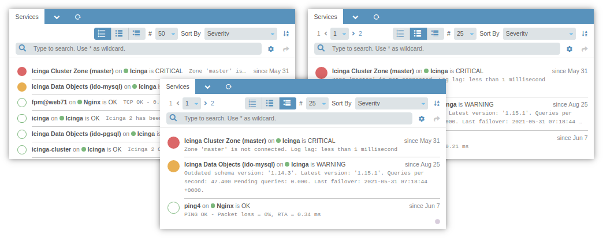
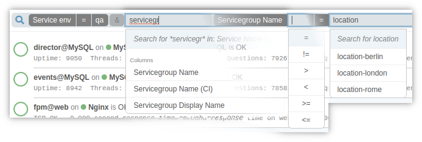
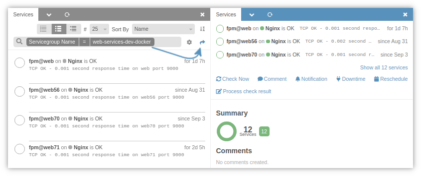

# Icinga DB Web

1. [Documentation](#documentation)
2. [Installation](#installation)
3. [Configuration](#configuration)
4. [Migration](#migration)
5. [New Features](#new-features)
6. [Concepts](#concepts)

**Icinga DB Web** pushes your monitoring stack to the next level.

Based on the lessons learnt with the base monitoring module, it offers a modern
and streamlined design to provide a clear and concise overview of your monitoring
environment.

## Documentation

The documentation is located in the [doc/](doc/) directory and also available
on [icinga.com/docs](https://icinga.com/docs/icingadb-web/latest/).

## Installation

For installing Icinga DB Web please check the [installation](https://icinga.com/docs/icingadb-web/latest/doc/02-Installation/)
chapter.

## Configuration

To configure Icinga DB Web please check the [configuration](https://icinga.com/docs/icingadb-web/latest/doc/03-Configuration/)
chapter.

## Migration

To migrate from the monitoring module to Icinga DB Web check the [migration](https://icinga.com/docs/icingadb-web/latest/doc/10-Migration/)
chapter.

## New Features

### Multiple List Layouts

The new view switcher displayed in the controls of lists allows to change their layout.
The majority of lists use this to switch between various levels of detail. The service
list below for example uses it to show a check's output at different lengths.

### New Search With Auto-Completion

We have greatly expanded the search functionality in list views. The so called search-bar
allows experienced users full control by keyboard to write their filters. It also aids
with contextual auto completion. There's also an editor for a more easy manipulation.

### Cleaner Detail Views

A host's or service's detail view has been restructured to show more details but also
to make more use of the available space. Important details also got moved to the top
so that they are visible right away without having to scroll down.

### Modal Dialogs

Acknowledging a problem, scheduling a downtime or sending a custom notification does
not take you away from where you've been. Instead a modal dialog is shown on top of
your current view.

### Bulk Operations

If you ever wanted to perform really big bulk acknowledgements or downtime schedules,
now is the time for it. Simply filter for the hosts or services you want to operate on
and then click on the little forward icon on the right. No more *shift-click* nightmares!
(Which are still possible, for the die-hard)

## Concepts

To learn more about our widget/view designs check the [concepts](https://icinga.com/docs/icinga-db/latest/icinga-db-web/doc/11-Concepts/)
chapter.
