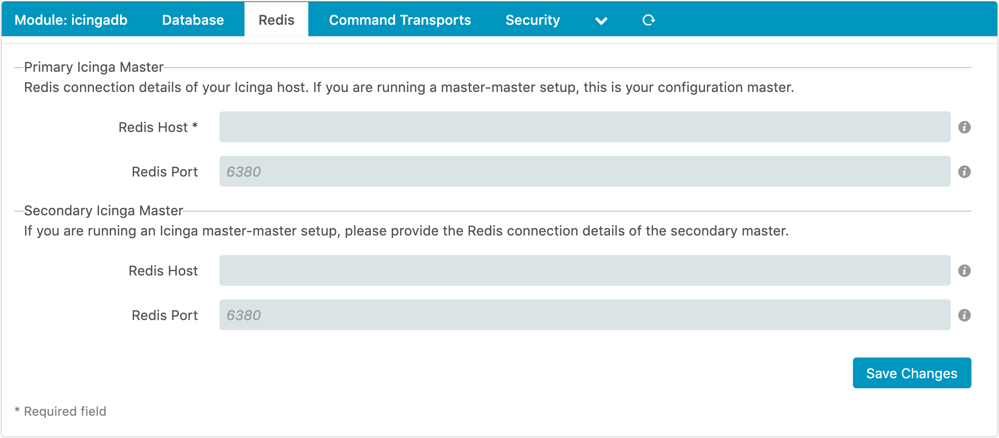

# Configuration

1. [Database](#database)
2. [Redis](#redis)
3. [Command Transports](#command-transports)
4. [Security](#security)

Icinga DB Web utilizes the monitoring module's configuration if applicable. This includes permissions and restrictions
which are currently configured the same way as for the [monitoring module](https://icinga.com/docs/icingaweb2/latest/modules/monitoring/doc/06-Security/).

Other monitoring module configurations used by Icinga DB Web include the [command transports](#command-transports)
and [security options](#security).

Icinga DB Web's own configuration options cover connection details to Icinga DB's [database](#database)
and [Redis](#redis) instance(s).

## Database

If not already done during the installation of Icinga DB Web, setup the Icinga DB database backend now.

Create a new [Icinga Web 2 resource](https://icinga.com/docs/icingaweb2/latest/doc/04-Resources/#database)
for [Icinga DB's database](https://icinga.com/docs/icingadb/latest/doc/02-Installation/#configuring-mysql)
using the `Configuration -> Application -> Resources` menu.

Then tell Icinga DB Web which database resource to use. This can be done in
`Configuration -> Modules -> icingadb -> Database`.

## Redis 

To view the most recent state information in Icinga DB Web make sure to configure the connection details to
[Icinga DB's redis](https://icinga.com/docs/icingadb/latest/doc/02-Installation/#installing-icinga-db-redis).

If you are running a high availability zone with two masters, the primary Icinga master is your configuration master.

Option             | Description
-------------------|------------------------
Redis Host         | IP address or FQDN, usually this is your Icinga master host
Redis Port         | The port which the Redis server is listening on (Default: 6380)

## Command Transports

Command transports are used to perform actions on the Icinga master such as acknowledgements and scheduling downtimes.
(amongst others)

These can be configured in `Configuration -> Modules -> icingadb -> Command Transports`. The configuration is described
[here](https://icinga.com/docs/icingaweb2/latest/modules/monitoring/doc/05-Command-Transports/).

## Security

Custom variables that should be masked by Icinga DB Web can be configured in
`Configuration -> Modules -> icingadb -> Security`. More details about this can be found [here](https://icinga.com/docs/icingaweb2/latest/modules/monitoring/doc/03-Configuration/#security-configuration).
