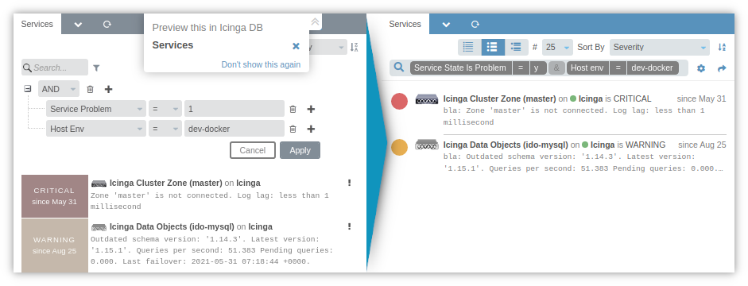

# Migration

1. [Configuration](#configuration)
2. [Dashboards and Navigation](#dashboards-and-navigation)
3. [Restrictions](#restrictions)
4. [Permissions](#permissions)

If you previously used the monitoring module, (built into Icinga Web 2) you may want to
migrate your existing configuration, custom dashboards and navigation items as well as
permissions or restrictions.

If that is the case, this chapter has you covered.

## Configuration

### Command Transports

Icinga DB Web still uses the same configuration format for command transports. This means that the file
`/etc/icingaweb2/modules/monitoring/commandtransports.ini` can simply be copied over to
`/etc/icingaweb2/modules/icingadb/commandtransports.ini`.

But note that Icinga DB Web doesn't support the commandfile (local and remote) anymore. Remove all sections
that do **not** define `transport=api`.

### Protected Customvars

The rules previously configured at `Configuration -> Modules -> monitoring -> Security` have moved into the
roles configuration as a new restriction. This is called `icingadb/protect/variables` and accepts the same
rules. Just copy them over.

## Dashboards and Navigation



The dashboard and navigation configuration does not change since these are related
to Icinga Web 2. However, if you've used the monitoring module's urls and you want
to update them, this might be straight forward if it's only the url path that needs
to change. Complex filters though can be cumbersome to rewrite.

That is why we provided the migration widget shown above. It will show up for every
monitoring module url for which there is a counterpart in Icinga DB Web. You can then
switch to the respective view in Icinga DB Web with a single click and either use the
new url from the address bar or add it the usual way to the dashboard and sidebar.

### Automation

For those who have a plethora of custom dashboards or navigation items there is also
a way to automate the migration of these urls. There is an API endpoint in Icinga DB
Web that the very same widget from above utilizes:

`/icingaweb2/icingadb/migrate/monitoring-url`

If you `POST` a JSON list there, you'll get a JSON list back with the transformed
urls in it. The returned list is ordered the same and any not recognized url is left
unchanged:

**Input:**  
```json
[
    "/icingaweb2/monitoring/list/services?hostgroup_name=prod-hosts|(_host_env=prod&_host_stage!=testing)",
    "/icingaweb2/businessprocess/process/show?config=production"
]
```

**Output**:  
```json
[
    "/icingaweb2/icingadb/services?hostgroup.name=prod-hosts|(host.vars.env=prod&host.vars.stage!=testing)",
    "/icingaweb2/businessprocess/process/show?config=production"
]
```

**cURL example:**  
`curl -s -HContent-Type:application/json -HAccept:application/json -u icingaadmin:icinga http://localhost/icingaweb2/icingadb/migrate/monitoring-url -d '["/icingaweb2/monitoring/list/services?hostgroup_name=prod-hosts|(_host_env=prod&_host_stage!=testing)","/icingaweb2/businessprocess/process/show?config=production"]'`

## Restrictions

### `monitoring/filter/objects`

This is now `icingadb/filter/objects` but still accepts the same filter syntax. Only the columns have changed
or support for them has been dropped. Check the table below for details:

Old Column Name      | New Column Name
---------------------|-----------------------
instance\_name       | -
host\_name           | host.name
hostgroup\_name      | hostgroup.name
service\_description | service.name
servicegroup\_name   | servicegroup.name
\_host\_customvar    | host.vars.customvar
\_service\_customvar | service.vars.customvar

### `monitoring/blacklist/properties`

This is now `icingadb/blacklist/variables`. However, it does not accept the same rules as
`monitoring/blacklist/properties`. It still accepts a comma separated list of GLOB like filters,
but with some features removed:

* No distinction between host and service variables (`host.vars.` and `service.vars.` prefixes are no longer keywords)
* No `**` to cross multiple level boundaries at once (`a.**.d` does not differ from `a.*.d`)
* Dots are not significant (`foo.*.oof` and `foo*oof` will both match `foo.bar.oof`)

Check the [security chapter](04-Security.md#variable-paths) for more details.

## Permissions

The command permissions have not changed. It is only the module identifier that has changed of course:
`monitoring.command.*` is now `icingadb.command.*`

The `no-monitoring/contacts` permission (or *fake refusal*) is now a restriction: `icingadb/blacklist/routes`.
Add `users,usergroups` to it to achieve the same effect.
